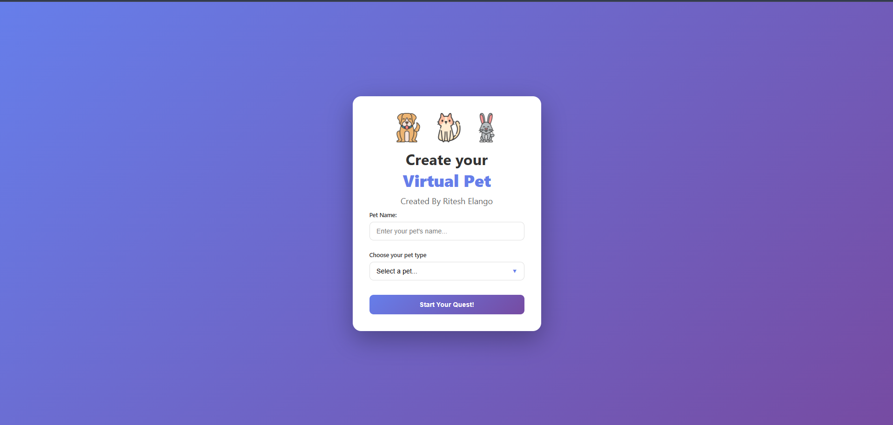
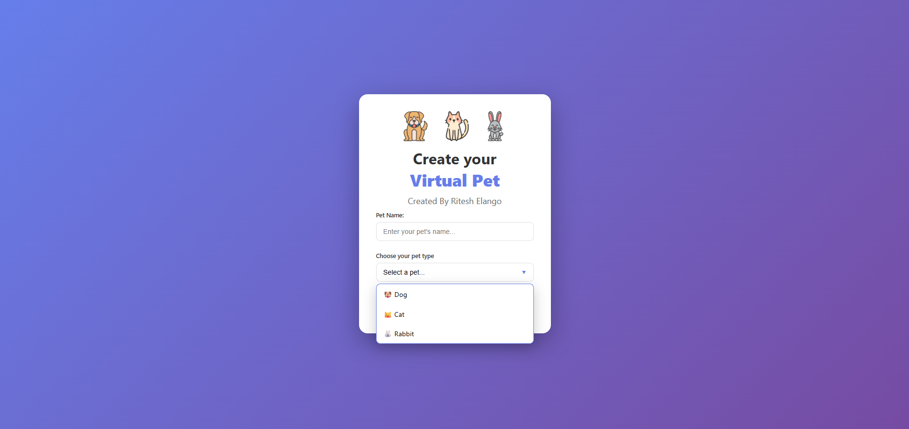

# Virtual Pet 🐶🐱🐰

**Status:** Work in Progress 🚧

A fun, interactive Virtual Pet game built with **HTML, CSS, and JavaScript**. Choose a pet, take care of it, and manage its stats while playing mini-games to earn money.  

> ⚠️ **Note:** This project is still under development! The UI is being improved, and more features are coming soon. Please don’t judge the project by its current state—it’s a work in progress.  

---

## Features

- Select between three pets: **Dog, Cat, Rabbit**  
- Track pet stats:  
  - Hunger  
  - Happiness  
  - Energy  
  - Health  
  - Cleanliness  
  - Money  
- Interact with your pet through buttons:  
  - **Feed** – decrease hunger, increase health and happiness  
  - **Play** – increase happiness but affects energy and cleanliness  
  - **Rest** – regain energy and health  
  - **Clean** – increase cleanliness but costs money  
  - **Health Check** – restore health if money is available  
  - **Earn Money** – solve simple math problems to earn in-game money  
- Dynamic pet images and styling based on pet type  
- Stats update in real-time every few seconds  

---

## Upcoming Features

- UI improvements and animations for a smoother experience  
- Sound effects for actions  
- More mini-games and challenges to earn money  
- Pet leveling or achievements system  
- Better responsive design for mobile screens  

---

## How to Run

1. Clone or download the repository  
2. Open the folder in VS Code or any code editor  
3. Open **`index.html`** in your browser  
4. Start the game and interact with your virtual pet!  

---

## Screenshots

### Setup Screen

### Main Game Screen

 - Still in progress!

